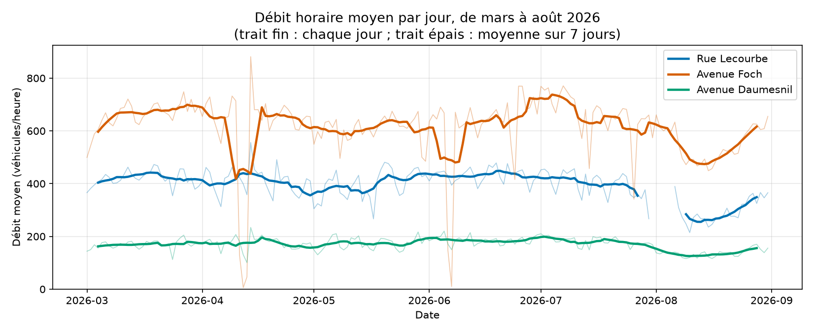
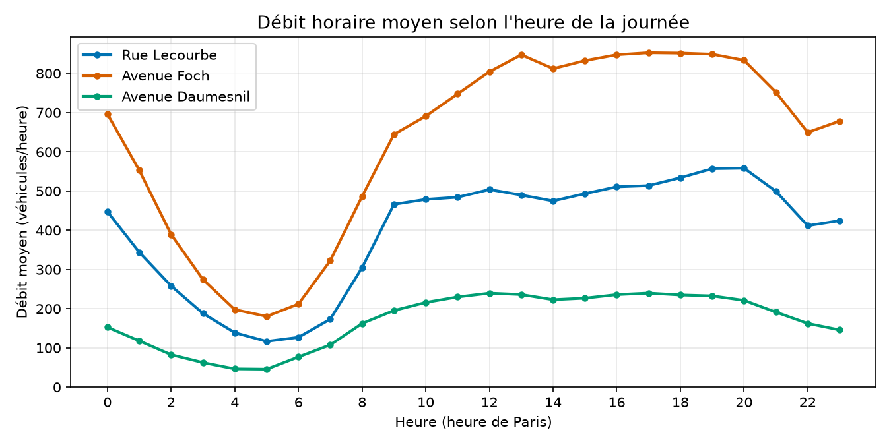
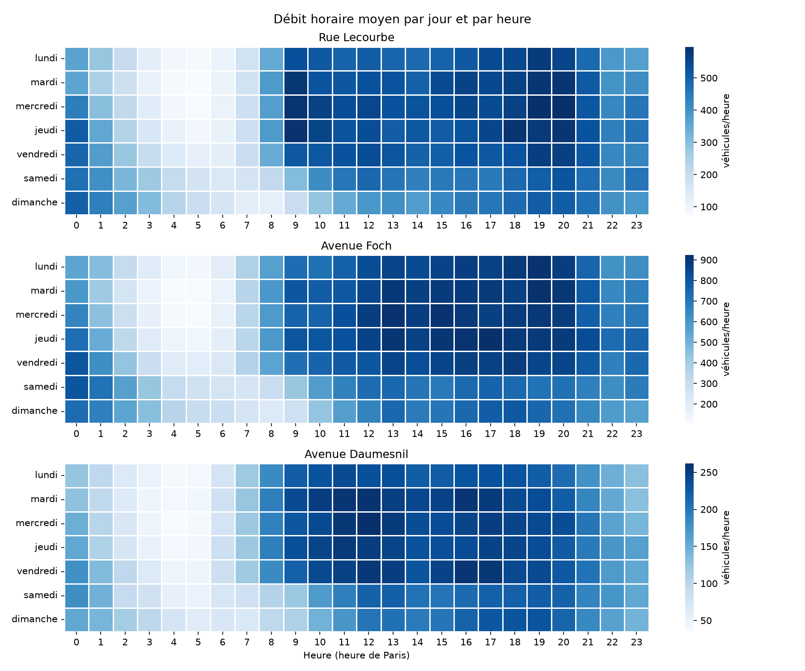
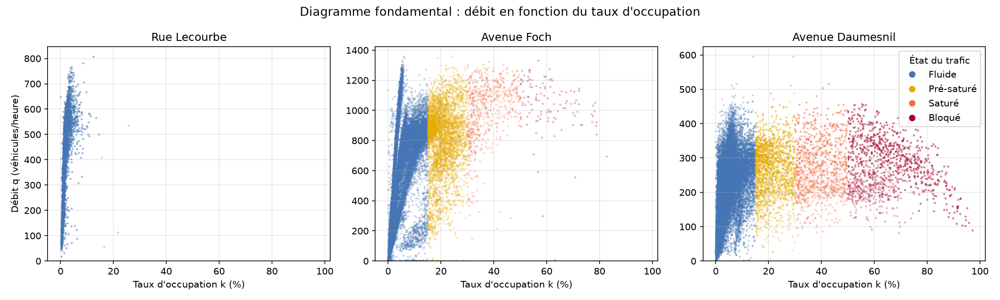

# Trafic routier à Paris : rue Lecourbe, avenue Foch et avenue Daumesnil

Analyse de six mois de comptages routiers de la Ville de Paris (mars à août 2026) sur trois axes, à partir des données brutes des capteurs : nettoyage, transformation, statistiques et visualisation en Python.

## La question

Comment le trafic évolue-t-il sur trois axes parisiens (rue Lecourbe, avenue Foch et avenue Daumesnil), et lequel de ces axes supporte le débit horaire le plus élevé ?

## Résultats clés

1. **L'avenue Foch est l'axe le plus chargé**, à toute heure et tous les jours : environ 620 véhicules par heure en moyenne, contre 396 sur la rue Lecourbe et 170 sur l'avenue Daumesnil.
2. **Le trafic suit surtout l'heure de la journée.** Il est environ 5 fois plus fort à l'heure la plus chargée qu'au creux de 5 h du matin. Il n'y a pas de pic du matin marqué, mais un plateau de 9 h à 20 h, avec un maximum en fin de journée (17 h sur l'avenue Foch, 20 h sur la rue Lecourbe).
3. **Le week-end réduit le trafic d'environ 10 %** et le décale : à 8 h, le débit est deux fois plus faible qu'en semaine, mais à 2 h du matin il est plus fort. Entre le jour le plus chargé (jeudi ou vendredi) et le dimanche, l'écart est d'environ 19 %.
4. **Le trafic est stable de mars à juillet, puis chute en août** : -31,5 % sur la rue Lecourbe et -25,9 % sur l'avenue Daumesnil par rapport à juin.
5. **Le trafic est principalement fluide** : 61 % des mesures brutes sont classées « Fluide », contre 7,5 % en pré-saturé, saturé ou bloqué. La congestion se voit sur l'avenue Daumesnil et l'avenue Foch, où le débit plafonne quand le taux d'occupation augmente.









## Les données

Les données proviennent du jeu « Comptages routiers permanents » de la Ville de Paris, importé via l'API Open Data : des boucles dans la chaussée mesurent, heure par heure et tronçon par tronçon, le débit (`q`, véhicules par heure) et le taux d'occupation (`k`, en %).

- rue Lecourbe (`Lecourbe`), 10 tronçons
- avenue Foch (`Av_Foch`), 12 tronçons
- avenue Daumesnil (`Av_Daumesnil`), 24 tronçons

Le jeu brut compte 200 744 mesures horaires sur 46 tronçons.

## Nettoyage

Chaque choix est justifié par les chiffres dans le notebook.

- **Dates** : les horodatages sont en UTC. Ils sont convertis en heure de Paris, et les 92 lignes qui tombent alors le 1er septembre sont supprimées.
- **Doublons** : aucun, ni en ligne entière ni par tronçon et par heure. En revanche, 52 heures sont absentes de la source pour tous les tronçons.
- **Colonnes** : les codes des carrefours amont et aval sont supprimés, car ils répètent les libellés (33 codes pour 33 noms).
- **Lignes inexploitables** : 50 % des lignes brutes ont `q` ou `k` manquant. Les mesures déclarées invalides ou prises sur une voie barrée sont supprimées (34 428 lignes, 17 %). L'état « Inconnu » est traité comme une valeur manquante, car il correspond exactement aux lignes sans taux d'occupation.
- **Imputation** : 87 % des trous dans les séries durent de 1 à 3 heures. Ils sont comblés par interpolation linéaire, tronçon par tronçon (201 valeurs de `q`, 819 de `k`). Les pannes plus longues sont laissées vides : les trous de plus d'un jour concentrent à eux seuls la moitié des heures manquantes, et les interpoler inventerait du trafic.
- **Valeurs aberrantes** : 8 débits supérieurs à 5 000 véhicules/heure, incohérents avec un taux d'occupation faible au même moment, sont repérés par la règle 3 × IQR appliquée tronçon par tronçon et remplacés par l'interpolation des heures voisines.

Après nettoyage, il reste 166 224 mesures sur 43 tronçons.

## Transformation

- **Variables temporelles** tirées de l'heure de Paris : heure, jour de la semaine, semaine ou week-end (131 jours de semaine, 53 de week-end).
- **Encodage** : un rang de 0 à 3 pour l'état du trafic, qui a un ordre ; une colonne 0/1 pour l'état de l'arc (ouvert ou non), pour l'axe et pour le week-end.
- **Statistiques par tronçon** : moyenne, médiane, écart-type, extrêmes et heures les plus chargées. Le débit moyen va de 570 à 731 véhicules/heure selon le tronçon sur l'avenue Foch, et de 87 à 222 sur l'avenue Daumesnil.

## Limites

- Il reste 22 % de valeurs manquantes pour le débit et 17 % pour le taux d'occupation, concentrées sur des tronçons où une grandeur n'est jamais mesurée, ce qui a pu fausser les moyennes par axe.
- Plusieurs tronçons voisins portent exactement le même débit (36 tronçons pour 13 profils distincts) : un même point de mesure est compté plusieurs fois dans les moyennes par axe.
- Sur l'avenue Foch, la moitié des tronçons n'a plus de débit mesuré à partir de juillet : la comparaison entre mois y est fragile.
- Sur la rue Lecourbe, peu de tronçons mesurent à la fois le débit et le taux d'occupation : la congestion y est mal observée.
- La période couvre six mois, dont les vacances d'été : les résultats ne décrivent pas une année entière.

## Lancer le projet

```bash
python3 -m venv .venv
source .venv/bin/activate
pip install -r requirements.txt
```

Puis exécuter le notebook `projet_data.ipynb` de haut en bas : il télécharge les données dans `data/` à la première exécution (1 à 3 minutes) et enregistre les graphiques dans `images/`.

## Utilisation de l'IA

**Outil utilisé** : Claude Code (Anthropic), dans VS Code.

**Pour quoi faire** :

- Jalon M1 : un accompagnement dans l'écriture du code et la correction d'erreurs.
- Jalons M2, M3 et 4 : l'IA a écrit le code et les commentaires de ces parties du notebook à partir du sujet et de la grille d'évaluation, puis relu l'ensemble du notebook par rapport à la grille.
- README : rédigé par l'IA à partir des résultats du notebook.

**Ce que j'ai décidé et modifié** :

- le choix des trois axes ;
- ne pas supprimer d'un bloc les lignes incomplètes (`dropna`), mais traiter les valeurs manquantes cas par cas ;
- télécharger les données dans une cellule du notebook plutôt que dans un script séparé ;
- appliquer les corrections issues de la relecture avec la grille (imputation des petits trous, encodage de l'état de l'arc, série temporelle sur six mois) ;
- la gestion des dépendances et des commits.
